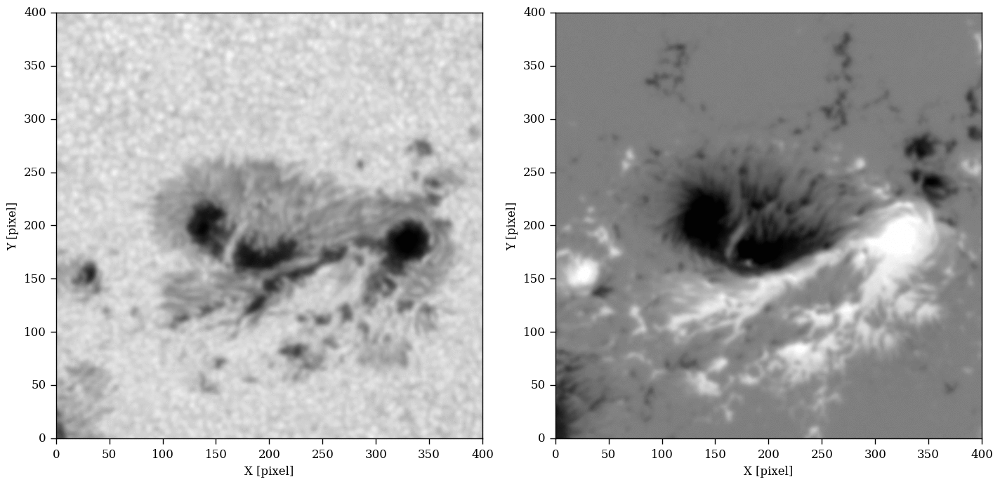

---
redirect_from:
  - "/03/enhancing-sdo-images"
title: 'Enhancing SDO Images'
prev_page:
  url: /02/1/notebook
  title: 'Notebook'
next_page:
  url: /03/1/notebook
  title: 'Notebook'
comment: "***PROGRAMMATICALLY GENERATED, DO NOT EDIT. SEE ORIGINAL FILES IN /content***"
---
Enhancing SDO/HMI images using deep learning
============================================
*by C. J. Diaz Baso and A. Asensio Ramos*

In this chapter we will learn how to use and apply deep learning tecniques to improve the resolution of our images in a fast and robust way. We have developed a deep fully convolutional neural network which deconvolves and super-resolves continuum images and magnetograms observed with the Helioseismic and Magnetic Imager (HMI) satellite. This improvement allow us to analyze the smallest-scale events in the solar atmosphere.

We want to note that although almost all the examples/images are written in python, we have omitted some materials in their original format (usually large FITS files) to avoid increasing the size of this notebook.

The software resulted from this project is hosted in the repository https://github.com/cdiazbas/enhance, which was published in [arxiv](https://arxiv.org/pdf/1706.02933.pdf) and [A&A](https://www.aanda.org/articles/aa/pdf/2018/06/aa31344-17.pdf) with a similar explanation. This software was developed with the python library [keras](https://keras.io/). We recommend visiting the `keras` documentation for anything related to how it works.

Example of the software `Enhance` applied to real solar images.
